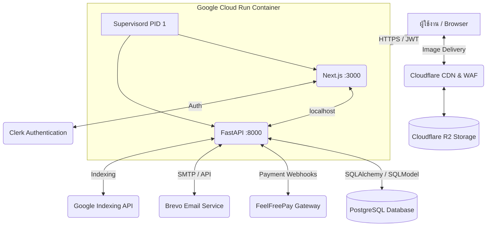

<div align="center">
  
  <h1>📖 MangaLabTH: Enterprise Webtoon & Manga Platform</h1>
  <p>🚀 แพลตฟอร์มเว็บแอปพลิเคชันอ่านการ์ตูนออนไลน์ระดับ Enterprise-Grade ที่รองรับผู้ใช้งานจำนวนมหาศาล</p>
  
  <p>
    
    
    
    
    
  </p>
</div>

---

## 🌟 ภาพรวมระบบ (Project Overview)

**MangaLabTH** เป็นแพลตฟอร์ม Full-Stack Application สำหรับอ่านมังงะและเว็บตูนออนไลน์ ที่ออกแบบด้วยสถาปัตยกรรมระดับ Enterprise มุ่งเน้นไปที่ **High Availability**, **Performance**, และ **Security** โดยมีระบบเศรษฐกิจแบบเหรียญ (Coin Economy) ที่มีความเสถียรสูงสุด รองรับการทำธุรกรรม (Transactions) พร้อมกันจำนวนมากโดยไม่เกิดปัญหา Race Conditions 

ระบบถูกแบ่งสถาปัตยกรรมออกเป็น Frontend (React Server Components) และ Backend (RESTful API) อย่างชัดเจน เพื่อรองรับการขยายตัว (Scalability) ในอนาคต

---

## 🏗️ สถาปัตยกรรมระบบ (System Architecture)



### 1. 🐳 Full-Stack Container (Google Cloud Run)
Frontend และ Backend รันอยู่ใน **Docker Container เดียวกัน** โดย Supervisord จัดการ 2 processes:

- **Next.js** (port 3000) — Frontend + SSR + ISR, standalone output mode
- **FastAPI** (port 8000) — Backend API (internal, เรียกผ่าน localhost)

### 2. 🖥️ Frontend — Next.js 16.2.4
- **Styling:** Tailwind CSS v4 + Framer Motion (สำหรับ Micro-animations)
- **State Management:** React Hooks, Server/Client Components Paradigm
- **Performance:** SSR + ISR, API เรียกผ่าน localhost (zero latency)
- **Security:** Clerk Middleware ป้องกัน Route ที่ต้องใช้สิทธิ์ Admin

### 3. ⚙️ Backend — FastAPI
- **ORM:** SQLModel (ครอบ SQLAlchemy)
- **Database:** PostgreSQL (Supabase)
- **Concurrency:** Asynchronous I/O + Row-level locking (`SELECT FOR UPDATE`) ป้องกัน Double-spending

### 4. 🔌 External Services
- 🛡️ **Cloudflare R2 & WAF:** จัดเก็บรูปภาพความเร็วสูง + Anti-Scraping
- 🔑 **Clerk Auth:** Passwordless, Social Login, RBAC
- 💳 **FeelFreePay Gateway:** PromptPay QR + TrueMoney Wallet + Double-Check Webhook
- 📧 **Brevo Email:** Notification + Debounce ลดความซ้ำซ้อน
- 🔍 **Google Indexing API:** SEO แบบ Real-time

---

## ✨ ฟีเจอร์หลัก (Key Features)

### 📚 Reader App (สำหรับผู้อ่าน)
- **Dynamic Homepage:** แสดงมังงะอัปเดตล่าสุด, จัดอันดับ Top 10 (Weekly/Monthly/All Time), ค้นหาแบบ Real-time
- **Smooth Reading Experience:** ระบบโหลดรูปภาพแบบ Lazy Loading พร้อม Skeleton UI
- **Coin Wallet & Transactions:** เติมเหรียญผ่านระบบอัตโนมัติ 24/7, เช็คประวัติการใช้งานเหรียญย้อนหลัง
- **Chapter Unlocking:** ปลดล็อกตอนอ่านล่วงหน้าด้วยเหรียญ พร้อมระบบ "รออ่านฟรี" ตามเวลาที่กำหนด (Auto-unlock timer)

### 👑 Admin & Analytics Dashboard (สำหรับผู้ดูแลระบบ)
- **Manga Management:** เพิ่ม/แก้ไข/ลบ เรื่องและตอนมังงะ, จัดการหมวดหมู่, อัปโหลดรูปลง Cloudflare R2 อัตโนมัติ
- **Enterprise Analytics:** Dashboard สถิติเชิงลึก 5 หมวดหมู่ (Traffic, Coins, Users, Chapters, Mangas) พร้อมกราฟแสดงผลสวยงาม
- **User Management:** จัดการสิทธิ์ผู้ใช้งาน, ตรวจสอบยอดเหรียญ, เติมเหรียญฟรีให้ผู้ใช้จากระบบหลังบ้าน
- **Economy Monitoring:** ติดตามกระแสเงินสด (Cash Flow), ยอดเหรียญที่ถูกเผา (Burned Coins), และนิยายที่สร้างรายได้สูงสุด (Top Grossing)

### 🛡️ Security & Background Jobs
- **Protected Images:** ซ่อน URL จริงของรูปภาพผ่าน Blob Proxy ป้องกันบอทดูดรูป
- **Smart Notification System:** แจ้งเตือนอีเมลตอนใหม่ให้ผู้อ่าน (Targeted Users) เฉพาะคนที่เคยเปย์เรื่องนั้นสูงสุด 50 อันดับแรก
- **Atomic Transactions:** คิวจัดการการปลดล็อกตอนที่รับประกันความถูกต้องของยอดเหรียญ 100%

---

## 📂 โครงสร้างโปรเจกต์ (Project Structure)

```text
MangaLabTH/
├── Dockerfile                # Multi-stage Full-Stack Docker image
├── supervisord.conf          # Process manager (Next.js + FastAPI)
├── cloudbuild.yaml           # Google Cloud Build CI/CD
├── .dockerignore             # Docker build exclusions
│
├── frontend/                 # Next.js Application
│   ├── src/
│   │   ├── app/              # App Router (Pages, Layouts, API Routes)
│   │   │   ├── (reader)/     # Public routes สำหรับผู้อ่าน
│   │   │   └── admin/        # Protected routes สำหรับผู้ดูแลระบบ
│   │   ├── components/       # Reusable UI Components
│   │   ├── lib/              # Utility functions, API clients, Types
│   │   └── proxy.ts          # Clerk Authentication Middleware
│   ├── public/               # Static assets
│   └── next.config.ts        # Next.js Config (standalone + rewrites)
│
├── backend/                  # FastAPI Application
│   ├── app/
│   │   ├── api/              # API Endpoints Router (v1)
│   │   ├── models/           # Database Models (SQLModel)
│   │   ├── schemas/          # Pydantic Schemas (Validation)
│   │   ├── services/         # Business Logic (R2, Brevo, Payment, Analytics)
│   │   └── main.py           # FastAPI Application Entrypoint
│   ├── alembic/              # Database Migrations
│   └── requirements.txt      # Python Dependencies
│
└── README.md
```

---

## 🛠️ คู่มือการติดตั้งสำหรับนักพัฒนา (Local Development Setup)

### 1. การตั้งค่า Backend (FastAPI)

```bash
# เข้าสู่โฟลเดอร์ backend
cd backend

# สร้างและเปิดใช้งาน Virtual Environment
python3 -m venv .venv
source .venv/bin/activate  # สำหรับ Windows: .venv\Scripts\activate

# ติดตั้ง Dependencies
pip install -r requirements.txt

# คัดลอกไฟล์ Environment และตั้งค่า (ต้องใส่ค่า Database URI, Clerk Keys, R2 Keys)
cp .env.example .env

# รัน Database Migrations (อัปเดตโครงสร้างตาราง)
alembic upgrade head

# เริ่มต้นเซิร์ฟเวอร์ (ทำงานที่ http://localhost:8000)
uvicorn app.main:app --reload --port 8000
```

### 2. การตั้งค่า Frontend (Next.js)

```bash
# เปิด Terminal ใหม่และเข้าสู่โฟลเดอร์ frontend
cd frontend

# ติดตั้ง Dependencies
npm install

# คัดลอกไฟล์ Environment และตั้งค่า (ต้องใส่ Clerk Keys, Backend URL)
cp .env.example .env.local

# เริ่มต้นเซิร์ฟเวอร์ (ทำงานที่ http://localhost:3000)
npm run dev
```

---

## 🚀 การนำขึ้นระบบจริง (Deployment Architecture)

ระบบถูกรวมเป็น **Docker Container เดียว** บน Google Cloud Run:

- **Full-Stack Container:** Next.js (port 3000) + FastAPI (port 8000) จัดการโดย Supervisord
- **Database:** ใช้ **Supabase** (PostgreSQL) พร้อม Connection Pooling
- **CI/CD:** Google Cloud Build → Artifact Registry → Cloud Run (auto-deploy)
- **CDN:** Cloudflare R2 + Custom Domain สำหรับ image delivery

> 📌 **คำแนะนำเพิ่มเติม:** ดูขั้นตอน Deploy แบบละเอียดใน [DEPLOY_GUIDE.md](./DEPLOY_GUIDE.md)

---

<div align="center">
  <p><i>สงวนลิขสิทธิ์ &copy; 2026 MangaLabTH. ระบบนี้เป็นทรัพย์สินทางปัญญา ห้ามคัดลอกหรือดัดแปลงโดยไม่ได้รับอนุญาต</i></p>
</div>
