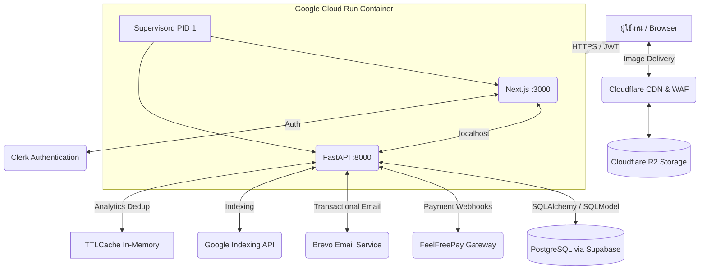

<div align="center">
  
  <h1>📖 MangaLabTH: Enterprise Webtoon & Manga Platform</h1>
  <p>🚀 แพลตฟอร์มเว็บแอปพลิเคชันอ่านการ์ตูนออนไลน์ระดับ Enterprise-Grade ที่รองรับผู้ใช้งานจำนวนมหาศาล</p>
  
  <p>
    
    
    
    
    
    
  </p>
</div>

---

## 🌟 ภาพรวมระบบ (Project Overview)

**MangaLabTH** เป็นแพลตฟอร์ม Full-Stack Application สำหรับอ่านมังงะและเว็บตูนออนไลน์ ที่ออกแบบด้วยสถาปัตยกรรมระดับ Enterprise มุ่งเน้นไปที่ **High Availability**, **Performance**, และ **Security** โดยมีระบบเศรษฐกิจแบบเหรียญ (Coin Economy) ที่มีความเสถียรสูงสุด รองรับการทำธุรกรรม (Transactions) พร้อมกันจำนวนมากโดยไม่เกิดปัญหา Race Conditions 

ระบบถูกแบ่งสถาปัตยกรรมออกเป็น Frontend (React Server Components) และ Backend (RESTful API) อย่างชัดเจน เพื่อรองรับการขยายตัว (Scalability) ในอนาคต

---

## 🏗️ สถาปัตยกรรมระบบ (System Architecture)



### 1. 🐳 Full-Stack Container (Google Cloud Run)
Frontend และ Backend รันอยู่ใน **Docker Container เดียวกัน** โดย Supervisord จัดการ 2 processes:

- **Next.js** (port 3000) — Frontend + SSR + ISR, standalone output mode
- **FastAPI** (port 8000) — Backend API (internal, เรียกผ่าน localhost)
- **Specs:** 1 vCPU, 1 GiB RAM, 0–3 instances (auto-scale), region: asia-southeast1

### 2. 🖥️ Frontend — Next.js 16.2.4
- **Styling:** Tailwind CSS v4 + Framer Motion (สำหรับ Micro-animations)
- **State Management:** React Hooks, Server/Client Components Paradigm
- **Performance:** SSR + ISR + On-demand Revalidation, API เรียกผ่าน localhost (zero latency)
- **SEO:** JSON-LD Structured Data, Dynamic Sitemap, Thai-friendly URL Slugs
- **Security:** Clerk Middleware ป้องกัน Route ที่ต้องใช้สิทธิ์ (`/admin`, `/profile`, `/coins`, `/account`)
- **Analytics:** Google Analytics 4 (GA4) พร้อม Custom Events (purchase, view, unlock, search)

### 3. ⚙️ Backend — FastAPI
- **ORM:** SQLModel (ครอบ SQLAlchemy Async)
- **Database:** PostgreSQL (Supabase) + asyncpg driver
- **Concurrency:** Asynchronous I/O + Row-level locking (`SELECT FOR UPDATE`) ป้องกัน Double-spending
- **Rate Limiting:** slowapi เพื่อป้องกัน abuse
- **Background Tasks:** ISR Revalidation, Email Notifications, Google Indexing

### 4. 🔌 External Services
- 🛡️ **Cloudflare R2 & WAF:** จัดเก็บรูปภาพความเร็วสูง + Anti-Scraping (CDN: `cdn.mangalab-th.com`)
- 🔑 **Clerk Auth:** Passwordless, Social Login, RBAC (Admin/User roles)
- 💳 **FeelFreePay Gateway:** PromptPay QR + TrueMoney Wallet + Idempotent Webhook
- 📧 **Brevo Email:** Welcome + Payment Confirmation + New Chapter Notification (Debounced)
- 🔍 **Google Indexing API:** SEO แบบ Real-time สำหรับ Content ใหม่

---

## ✨ ฟีเจอร์หลัก (Key Features)

### 📚 Reader App (สำหรับผู้อ่าน)
- **Dynamic Homepage:** แสดงมังงะอัปเดตล่าสุด, จัดอันดับ Top 10 (Weekly/Monthly/All Time) พร้อม Cache 5 นาที, ค้นหาแบบ Real-time Autocomplete
- **Smooth Reading Experience:** ระบบโหลดรูปภาพแบบ Lazy Loading, Scroll Progress Bar, Reading History บันทึกใน localStorage
- **Coin Wallet & Transactions:** เติมเหรียญผ่าน QR PromptPay หรือ TrueMoney ตลอด 24/7 พร้อม Polling Confirmation, เช็คประวัติย้อนหลัง
- **Chapter Unlocking:** ปลดล็อกตอนอ่านล่วงหน้าด้วยเหรียญ พร้อมระบบ "รออ่านฟรี" (Countdown Timer), เวลาถึงเปิดอ่านฟรีอัตโนมัติ
- **SEO-Optimized:** JSON-LD (ComicSeries, BreadcrumbList), Dynamic Metadata, Sitemap ครอบคลุมทุกมังงะและทุกตอน

### 👑 Admin & Analytics Dashboard (สำหรับผู้ดูแลระบบ)
- **Manga Management:** เพิ่ม/แก้ไข/ลบ เรื่องและตอนมังงะ, จัดการหมวดหมู่, อัปโหลดรูปลง Cloudflare R2 พร้อมแปลง WebP อัตโนมัติ
- **Chapter Management:** Batch Upload/Replace หน้ามังงะ, จัดลำดับด้วย Drag & Drop, ตั้งค่าราคาเหรียญและเวลาปลดล็อก
- **Enterprise Analytics (5 Dashboards):**
  - 📊 **Traffic Overview** — ยอดเข้าชม/อ่าน, กราฟรายวัน, สัดส่วนตามหมวดหมู่, Growth Metrics
  - 💰 **Coin Deep Dive** — ARPPU, Conversion Rate, Package Popularity, Top Grossing Chapters
  - 👥 **Users Analytics** — Registration Trend, Paid/Free Ratio, Wealth Distribution, Top Spenders
  - 📖 **Chapters Analytics** — Unlock Trend, Free vs Paid, Top Revenue Chapters
  - 📚 **Mangas Portfolio** — Revenue by Category, Top Franchises, Read-Through Rate
- **User Management:** จัดการสิทธิ์ผู้ใช้งาน (Admin/User), ตรวจสอบยอดเหรียญ, เติมเหรียญฟรีจากระบบหลังบ้าน
- **Transaction Monitoring:** ดูประวัติธุรกรรมทั้งหมด, กรองตามประเภท, ติดตามกระแสเงินสดและยอดเหรียญในระบบ

### 🛡️ Security & Background Jobs
- **Image Security:** Magic Byte Validation (ตรวจสอบไฟล์รูปจริงๆ), Path Traversal Prevention, Blob Proxy ป้องกันบอทดูดรูป
- **Payment Security:** Idempotent Fulfillment ป้องกัน Double-crediting, Webhook Secret Verification, Polling Fallback
- **Smart Notification System:** แจ้งเตือนอีเมลตอนใหม่ (Debounced 10 นาที) เฉพาะ Top 50 ผู้อ่านที่เคยเปย์เรื่องนั้นมากที่สุด
- **Atomic Transactions:** `SELECT ... FOR UPDATE` ป้องกัน Race Conditions รับประกันความถูกต้องของยอดเหรียญ 100%
- **Analytics Dedup:** IP-based + TTLCache (20K entries, 1hr TTL) ป้องกันบอทปั่นยอดวิว + Bot User-Agent Filtering

---

## 📂 โครงสร้างโปรเจกต์ (Project Structure)

```text
MangaLabTH/
├── Dockerfile                # Multi-stage Full-Stack Docker image
├── supervisord.conf          # Process manager (Next.js + FastAPI)
├── cloudbuild.yaml           # Google Cloud Build CI/CD pipeline
├── DEPLOY_GUIDE.md           # คู่มือ Deploy แบบละเอียด
│
├── frontend/                 # Next.js 16.2.4 Application
│   ├── src/
│   │   ├── app/
│   │   │   ├── (reader)/     # Public routes (11 pages)
│   │   │   │   ├── page.tsx                    # หน้าแรก (Homepage)
│   │   │   │   ├── manga/[slug]/page.tsx       # รายละเอียดมังงะ
│   │   │   │   ├── [slug]/[chapterSlug]/       # ตัวอ่านมังงะ + Access Gate
│   │   │   │   ├── coins/page.tsx              # เติมเหรียญ + ชำระเงิน
│   │   │   │   ├── search/page.tsx             # ค้นหามังงะ
│   │   │   │   ├── category/[slug]/page.tsx    # กรองตามหมวดหมู่
│   │   │   │   ├── profile/page.tsx            # โปรไฟล์ผู้ใช้
│   │   │   │   └── about/page.tsx              # เกี่ยวกับเรา
│   │   │   ├── admin/        # Protected routes (10 pages)
│   │   │   │   ├── page.tsx                    # Dashboard หลัก
│   │   │   │   ├── manga/page.tsx              # จัดการมังงะ (CRUD)
│   │   │   │   ├── chapters/page.tsx           # จัดการตอน (CRUD + Upload)
│   │   │   │   ├── users/page.tsx              # จัดการผู้ใช้
│   │   │   │   ├── transactions/page.tsx       # ดูธุรกรรมทั้งหมด
│   │   │   │   └── analytics/                  # Analytics 5 หน้า
│   │   │   │       ├── page.tsx                # Traffic Overview
│   │   │   │       ├── coins/page.tsx          # Coin Deep Dive
│   │   │   │       ├── users/page.tsx          # Users Analytics
│   │   │   │       ├── chapters/page.tsx       # Chapters Analytics
│   │   │   │       └── mangas/page.tsx         # Mangas Portfolio
│   │   │   ├── api/revalidate/route.ts         # ISR Revalidation endpoint
│   │   │   ├── sitemap.ts                      # Dynamic XML Sitemap
│   │   │   └── layout.tsx                      # Root Layout + SEO Metadata
│   │   ├── components/       # 15 Reusable UI Components
│   │   │   ├── Navbar.tsx              # Navigation + Balance Display
│   │   │   ├── MangaCard.tsx           # การ์ดมังงะ (Grid)
│   │   │   ├── UpdateMangaCard.tsx     # การ์ดอัปเดตล่าสุด
│   │   │   ├── TopMangaRanking.tsx     # Sidebar จัดอันดับ
│   │   │   ├── ChapterListClient.tsx   # รายการตอน (Client-side)
│   │   │   ├── SearchAutocomplete.tsx  # ค้นหา Autocomplete
│   │   │   ├── MotionWrappers.tsx      # Framer Motion Wrappers
│   │   │   ├── ThemeProvider.tsx       # Theme Context
│   │   │   ├── ThemeSwitcher.tsx       # สลับธีม
│   │   │   ├── AnalyticsTracker.tsx    # GA4 Event Tracker
│   │   │   ├── Footer.tsx             # Footer
│   │   │   └── ...                     # DeviceDetector, ReadingTrickPopup, etc.
│   │   └── lib/
│   │       ├── api.ts                  # API Client (624 บรรทัด, retry logic)
│   │       ├── types.ts                # Shared TypeScript Types
│   │       ├── utils.ts                # Thai datetime, formatters, slugify
│   │       └── analytics.ts            # GA4 Custom Events
│   ├── src/proxy.ts          # Clerk Auth Middleware
│   ├── public/               # Static assets (logo.webp, etc.)
│   └── next.config.ts        # Standalone + Image Patterns + API Rewrites
│
├── backend/                  # FastAPI Application
│   ├── app/
│   │   ├── main.py           # Entry point (CORS, Rate Limiting, DB Init)
│   │   ├── config.py         # Pydantic Settings (Environment Variables)
│   │   ├── database.py       # Async Engine + Session + DB Seeding
│   │   ├── api/
│   │   │   ├── deps.py       # Auth Dependencies (Clerk JWT, RBAC)
│   │   │   └── v1/           # 8 API Routers
│   │   │       ├── manga.py         # Manga CRUD + Ranking
│   │   │       ├── chapters.py      # Chapter/Page CRUD + Unlock Logic
│   │   │       ├── users.py         # User Management + Stats
│   │   │       ├── transactions.py  # Coin Economy (Atomic)
│   │   │       ├── payments.py      # FeelFreePay Integration
│   │   │       ├── upload.py        # Secure File Upload + WebP
│   │   │       ├── analytics.py     # 5 Analytics Dashboards
│   │   │       └── settings.py      # Global Theme Settings
│   │   ├── models/           # 5 SQLModel Files
│   │   │   ├── manga.py      # Manga, Chapter, Page
│   │   │   ├── user.py       # User (Clerk-linked)
│   │   │   ├── transaction.py # Transaction, CoinPackage
│   │   │   ├── analytics.py  # DailyMangaView, DailyMangaRead
│   │   │   └── setting.py    # SystemSetting (Key-Value)
│   │   ├── schemas/          # Pydantic v2 Schemas
│   │   │   ├── manga.py      # Manga/Chapter/Page DTOs
│   │   │   ├── user.py       # User DTOs
│   │   │   └── transaction.py # Transaction/Package DTOs
│   │   └── services/         # 10 Business Logic Services
│   │       ├── storage.py              # Cloudflare R2 (Upload/Delete/Presign)
│   │       ├── feelfreepay_service.py  # Payment Gateway
│   │       ├── email_service.py        # Brevo Transactional Email
│   │       ├── email_templates.py      # HTML Email Templates (Dark/Gold)
│   │       ├── notification_service.py # Debounced Chapter Alerts
│   │       ├── analytics.py            # View/Read Dedup + Upsert
│   │       ├── revalidate.py           # Next.js ISR Revalidation
│   │       ├── google_notify.py        # Google Indexing API
│   │       ├── image.py                # WebP Conversion + Resize
│   │       └── http_client.py          # Singleton httpx Client
│   ├── alembic/              # Database Migrations
│   ├── alembic.ini           # Alembic Configuration
│   └── requirements.txt      # Python Dependencies
│
└── README.md
```

---

## 🛠️ คู่มือการติดตั้งสำหรับนักพัฒนา (Local Development Setup)

### Prerequisites
- Python 3.11+
- Node.js 20+
- PostgreSQL (หรือใช้ Supabase)

### 1. การตั้งค่า Backend (FastAPI)

```bash
# เข้าสู่โฟลเดอร์ backend
cd backend

# สร้างและเปิดใช้งาน Virtual Environment
python3 -m venv .venv
source .venv/bin/activate  # สำหรับ Windows: .venv\Scripts\activate

# ติดตั้ง Dependencies
pip install -r requirements.txt

# คัดลอกไฟล์ Environment และตั้งค่า (ต้องใส่ค่า Database URI, Clerk Keys, R2 Keys)
cp .env.example .env

# รัน Database Migrations (อัปเดตโครงสร้างตาราง)
alembic upgrade head

# เริ่มต้นเซิร์ฟเวอร์ (ทำงานที่ http://localhost:8000)
uvicorn app.main:app --reload --port 8000
```

### 2. การตั้งค่า Frontend (Next.js)

```bash
# เปิด Terminal ใหม่และเข้าสู่โฟลเดอร์ frontend
cd frontend

# ติดตั้ง Dependencies
npm install

# คัดลอกไฟล์ Environment และตั้งค่า (ต้องใส่ Clerk Keys, Backend URL)
cp .env.example .env.local

# เริ่มต้นเซิร์ฟเวอร์ (ทำงานที่ http://localhost:3000)
npm run dev
```

### 3. Environment Variables ที่จำเป็น

| ส่วน | ตัวแปร | คำอธิบาย |
|------|--------|----------|
| Database | `DATABASE_URL` | PostgreSQL connection string (Supabase) |
| Auth | `CLERK_SECRET_KEY` | Clerk Backend Secret Key |
| Auth | `NEXT_PUBLIC_CLERK_PUBLISHABLE_KEY` | Clerk Frontend Key |
| Storage | `R2_ACCESS_KEY_ID`, `R2_SECRET_ACCESS_KEY` | Cloudflare R2 credentials |
| Storage | `R2_BUCKET_NAME`, `R2_ENDPOINT` | R2 bucket config |
| Payment | `FFP_MERCHANT_ID`, `FFP_SECRET_KEY` | FeelFreePay credentials |
| Email | `BREVO_API_KEY` | Brevo API key สำหรับส่งอีเมล |
| SEO | `GOOGLE_INDEXING_CREDENTIALS` | Google Service Account JSON |
| Frontend | `NEXT_PUBLIC_R2_PUBLIC_URL` | CDN URL สำหรับรูปภาพ |
| Frontend | `NEXT_PUBLIC_SITE_URL` | URL หลักของเว็บไซต์ |

> 📋 ดูรายละเอียดทั้งหมดใน `backend/.env.example` และ `frontend/.env.example`

---

## 🚀 การนำขึ้นระบบจริง (Deployment)

ระบบถูกรวมเป็น **Docker Container เดียว** บน Google Cloud Run:

| องค์ประกอบ | รายละเอียด |
|------------|-----------|
| **Container** | Next.js (port 3000) + FastAPI (port 8000) จัดการโดย Supervisord |
| **Database** | Supabase (PostgreSQL) + Connection Pooling |
| **CI/CD** | Cloud Build → Artifact Registry → Cloud Run (auto-deploy on push) |
| **CDN** | Cloudflare R2 + Custom Domain (`cdn.mangalab-th.com`) |
| **Region** | `asia-southeast1` (Singapore) |
| **Scaling** | 0–3 instances, 1 vCPU / 1 GiB RAM per instance |
| **Health Check** | `curl localhost:3000` ทุก 30 วินาที |

> 📌 **คำแนะนำเพิ่มเติม:** ดูขั้นตอน Deploy แบบละเอียดใน [DEPLOY_GUIDE.md](./DEPLOY_GUIDE.md)

---

## 📊 Tech Stack Summary

| Layer | Technology |
|-------|-----------|
| Frontend Framework | Next.js 16.2.4 (App Router, RSC) |
| UI / Styling | Tailwind CSS v4, Framer Motion |
| Authentication | Clerk (JWT, Social Login, RBAC) |
| Backend Framework | FastAPI (Python 3.11) |
| ORM | SQLModel + SQLAlchemy (Async) |
| Database | PostgreSQL (Supabase) |
| Object Storage | Cloudflare R2 (S3-compatible) |
| Payment Gateway | FeelFreePay (QR + TrueWallet) |
| Email Service | Brevo (Sendinblue) v3 API |
| Analytics | Google Analytics 4 + Custom Backend |
| SEO | Google Indexing API, JSON-LD, Sitemap |
| Container | Docker + Supervisord |
| CI/CD | Google Cloud Build |
| Hosting | Google Cloud Run |
| Rate Limiting | slowapi |
| Image Processing | Pillow (WebP, Resize) |

---

<div align="center">
  <p><i>สงวนลิขสิทธิ์ &copy; 2026 MangaLabTH. ระบบนี้เป็นทรัพย์สินทางปัญญา ห้ามคัดลอกหรือดัดแปลงโดยไม่ได้รับอนุญาต</i></p>
</div>
